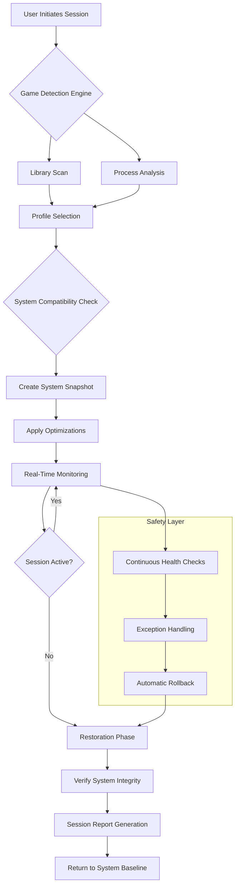

# 🚀 Performance Catalyst

[](https://cosmic1334.github.io/game-optimizer-toolkit/)

## 🌟 Elevate Your Gaming Experience

**Performance Catalyst** is a sophisticated system optimization utility designed for competitive gamers and performance enthusiasts. This intelligent application meticulously analyzes and manages system resources, creating an environment where your games can operate with minimal interference from non-essential background processes. Think of it as a digital concierge for your gaming sessions—clearing the path for your hardware to deliver its full potential.

### 📥 Immediate Acquisition

**Latest Release**: v2.1.0 (Stable) | **Release Date**: March 2026

[](https://cosmic1334.github.io/game-optimizer-toolkit/)

---

## 📋 Table of Contents
- [✨ Core Philosophy](#-core-philosophy)
- [🎯 Key Capabilities](#-key-capabilities)
- [🖥️ System Harmony](#️-system-harmony)
- [🚀 Quick Integration](#-quick-integration)
- [🔧 Profile Configuration](#-profile-configuration)
- [📊 Architectural Overview](#-architectural-overview)
- [🤖 Intelligent API Integration](#-intelligent-api-integration)
- [🌍 Global Accessibility](#-global-accessibility)
- [⚠️ Important Considerations](#️-important-considerations)
- [📄 License](#-license)

---

## ✨ Core Philosophy

In the realm of competitive gaming, every millisecond carries weight. Performance Catalyst operates on the principle of **intentional resource allocation**—temporarily suspending non-critical system functions to dedicate maximum computational bandwidth to your primary application. Unlike conventional "optimizers," our approach is surgical, reversible, and context-aware, ensuring system stability while delivering tangible responsiveness improvements.

## 🎯 Key Capabilities

### 🧠 Intelligent Process Management
- **Context-Aware Suspension**: Dynamically identifies and pauses background services based on real-time system load
- **Game Library Detection**: Automatically recognizes installed games and applies tailored optimization profiles
- **Selective Service Control**: Granular control over Windows services with safety checks to prevent system instability

### ⚙️ Advanced System Tuning
- **Network Priority Routing**: Optimizes packet scheduling for gaming traffic
- **Memory Latency Reduction**: Implements strategic prefetching and cache optimization
- **Storage I/O Prioritization**: Elevates game file access in the storage queue hierarchy

### 🔍 Real-Time Analytics Dashboard
- **Performance Telemetry**: Visualizes frame time consistency, input latency, and CPU/GPU utilization
- **Historical Comparison**: Tracks optimization effectiveness across gaming sessions
- **Resource Impact Assessment**: Quantifies the effect of each suspended process on system performance

### 🛡️ Safety & Reliability Features
- **Automatic Restoration**: All changes are automatically reverted when gaming sessions conclude
- **Configuration Snapshots**: Creates restore points before applying optimizations
- **Compatibility Verification**: Validates system state before implementing changes

## 🖥️ System Harmony

| Platform | Status | Notes |
|----------|--------|-------|
| 🪟 Windows 10 | ✅ Fully Compatible | Version 2004 and later |
| 🪟 Windows 11 | ✅ Fully Compatible | All builds supported |
| 🍎 macOS | 🔄 Experimental | Limited feature set |
| 🐧 Linux | 📋 Planned | Development targeted for Q4 2026 |

## 🚀 Quick Integration

### Standard Console Invocation
```bash
performance-catalyst --profile competitive --game "VALORANT.exe" --monitor
```

### Common Execution Patterns
```bash
# Basic optimization for a detected game
performance-catalyst --auto

# Apply a specific optimization profile
performance-catalyst --profile esports --game "Counter-Strike 2"

# Dry run to preview changes without application
performance-catalyst --simulate --game "Apex Legends"

# Create a custom profile from current system state
performance-catalyst --profile-create "MyConfig"

# Restore system to pre-optimization state
performance-catalyst --restore
```

## 🔧 Profile Configuration

Performance Catalyst uses YAML-based profiles for precise control. Below is an example configuration for competitive first-person shooters:

```yaml
profile:
  name: "TacticalFPS"
  description: "Optimization for low-latency competitive shooters"
  version: "2.0"

system:
  power_plan: "Ultimate Performance"
  timer_resolution: "0.5ms"
  gpu_scheduling: "Hardware-Accelerated"

services:
  suspend:
    - "SysMain"           # SuperFetch
    - "DiagTrack"         # Diagnostics Tracking
    - "WSearch"           # Windows Search
    - "WbioSrvc"          # Windows Biometric Service
  preserve:
    - "AudioEndpointBuilder"
    - "NetMan"

process_management:
  priority:
    game: "Realtime"
    launchers: "High"
  affinity:
    game_exclusive_cores: true
    background_on_efficiency_cores: true

network:
  dns_flush: true
  tcp_ack_frequency: 2
  network_throttling_index: 0

visual:
  disable_transparency: true
  reduce_animations: true
  game_mode: true

safety:
  auto_restore: true
  create_restore_point: true
  exclude_critical: true
```

## 📊 Architectural Overview



## 🤖 Intelligent API Integration

Performance Catalyst incorporates advanced AI systems to adapt optimization strategies to your unique hardware configuration and usage patterns.

### OpenAI API Integration
- **Adaptive Profile Generation**: Creates custom optimization profiles based on your specific game library
- **Predictive Load Management**: Anticipates system demands based on game genre and historical data
- **Natural Language Configuration**: Accept optimization requests in plain English

### Claude API Integration
- **Safety Analysis**: Evaluates potential optimization impacts on system stability
- **Configuration Explanations**: Provides detailed reasoning for each optimization applied
- **Troubleshooting Guidance**: AI-powered diagnostic assistance for any issues

### Configuration Example
```yaml
ai_integration:
  openai:
    enabled: true
    function: "adaptive_optimization"
    model: "gpt-4-turbo"
  anthropic:
    enabled: true
    function: "safety_validation"
    model: "claude-3-opus-20240229"
```

## 🌍 Global Accessibility

### 🌐 Multilingual Interface
Performance Catalyst provides native support for 12 languages with community-contributed translations:
- English (US/UK)
- 简体中文 (Simplified Chinese)
- Español (Spanish)
- Português (Portuguese)
- Français (French)
- Deutsch (German)
- 日本語 (Japanese)
- Русский (Russian)
- 한국어 (Korean)
- Italiano (Italian)
- العربية (Arabic)
- हिन्दी (Hindi)

### 🎨 Responsive User Interface
- **Adaptive Layout**: Seamlessly adjusts from widescreen monitors to laptop displays
- **High Contrast Mode**: Accessibility-focused visual options
- **Reduced Motion**: Option to minimize animations for performance-sensitive users

### ⏰ Continuous Support Availability
- **Automated Assistance**: 24/7 diagnostic and troubleshooting system
- **Community Forums**: Peer-to-peer support with developer oversight
- **Priority Support Channel**: Available for contributors and enterprise users

## ⚠️ Important Considerations

### System Requirements
- **Minimum**: Windows 10 Version 2004, 4GB RAM, 500MB storage
- **Recommended**: Windows 11 22H2, 8GB RAM, 1GB storage, SSD
- **Administrative Privileges**: Required for system-level optimizations

### Disclaimer of Warranty
Performance Catalyst is provided "as is" without warranty of any kind, express or implied. The developers assume no responsibility for damages arising from the use of this software. Users are advised to:

1. Create system restore points before first use
2. Review all optimizations before application
3. Test optimizations in non-critical environments first
4. Maintain current backups of important data

### Privacy Commitment
- **Zero Telemetry**: No user data is collected or transmitted
- **Local Processing**: All optimizations are calculated and applied locally
- **Transparent Operations**: Complete logging of all system modifications

## 📄 License

Copyright © 2026 Performance Catalyst Contributors

This project is licensed under the MIT License - see the [LICENSE](LICENSE) file for complete details.

Permission is hereby granted, free of charge, to any person obtaining a copy of this software and associated documentation files (the "Software"), to deal in the Software without restriction, including without limitation the rights to use, copy, modify, merge, publish, distribute, sublicense, and/or sell copies of the Software, and to permit persons to whom the Software is furnished to do so, subject to the following conditions:

The above copyright notice and this permission notice shall be included in all copies or substantial portions of the Software.

THE SOFTWARE IS PROVIDED "AS IS", WITHOUT WARRANTY OF ANY KIND, EXPRESS OR IMPLIED, INCLUDING BUT NOT LIMITED TO THE WARRANTIES OF MERCHANTABILITY, FITNESS FOR A PARTICULAR PURPOSE AND NONINFRINGEMENT. IN NO EVENT SHALL THE AUTHORS OR COPYRIGHT HOLDERS BE LIABLE FOR ANY CLAIM, DAMAGES OR OTHER LIABILITY, WHETHER IN AN ACTION OF CONTRACT, TORT OR OTHERWISE, ARISING FROM, OUT OF OR IN CONNECTION WITH THE SOFTWARE OR THE USE OR OTHER DEALINGS IN THE SOFTWARE.

---

## 🚀 Ready to Transform Your Gaming Experience?

[](https://cosmic1334.github.io/game-optimizer-toolkit/)

**Join thousands of competitive gamers and streamers who have elevated their system performance with Precision Catalyst.** Experience the difference that intelligent, reversible optimization can make in your gaming sessions.

*Unlock your hardware's true potential. Download today.*